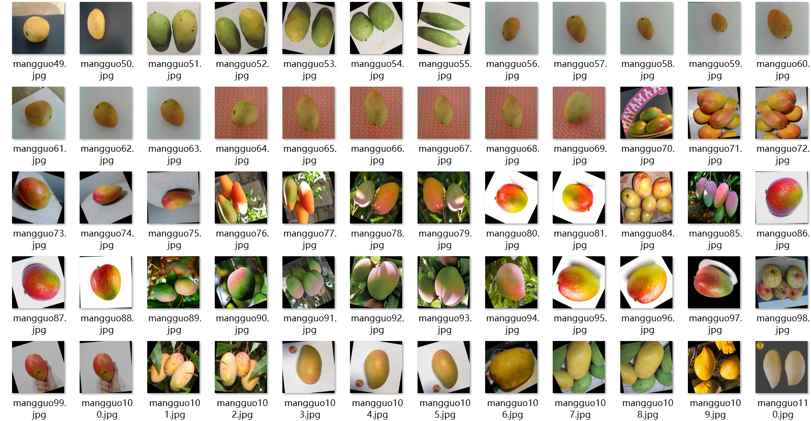

# [Object Detection Dataset] Mango Detection Dataset

897 Images: VOC+YOLO format

Dataset format: Pascal VOC format + YOLO format (excluding the split path in txt files, only containing jpg images along with corresponding VOC format xml files and YOLO format txt files)

Number of images (jpg file count): 897

Number of annotations (xml file count): 897

Number of annotations (txt file count): 897

Number of annotation categories: 1

Annotation category names: ["mango"]

Number of bounding box instances for each category:

Mango bounding box instances = 1398

Total number of bounding boxes: 1398

Usage of labelImg tool for annotation:

Important note: The images were collected from web crawling and labeled independently by myself, which is original content and should not be copied without permission.

Image overview:

## Images

---

Here is a pay link on Stripe (https://buy.stripe.com/3cs8yP7sY87d0vu9AB). Please contact me lonlonago@foxmail.com after funding $89, and I will send you a complete data files, thank you!

